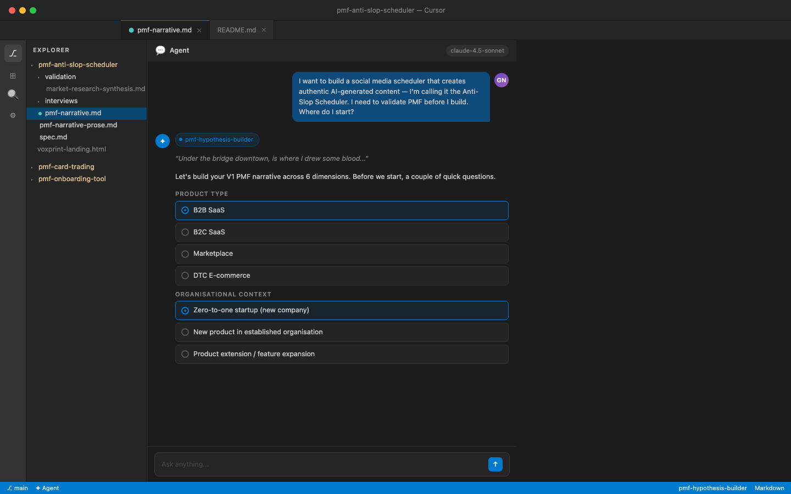
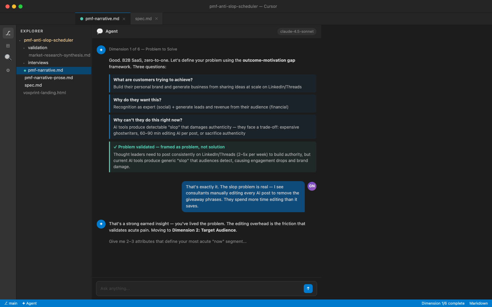
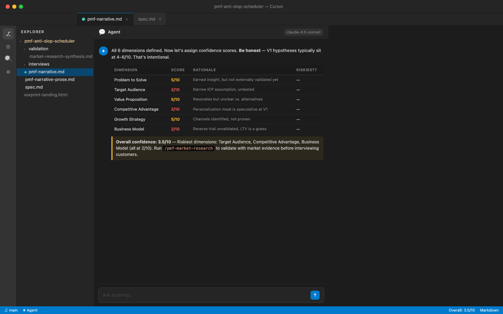
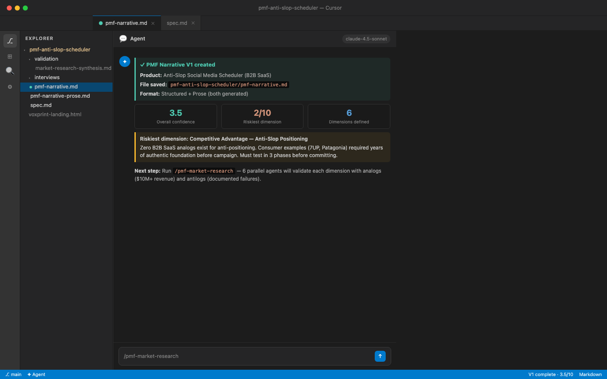
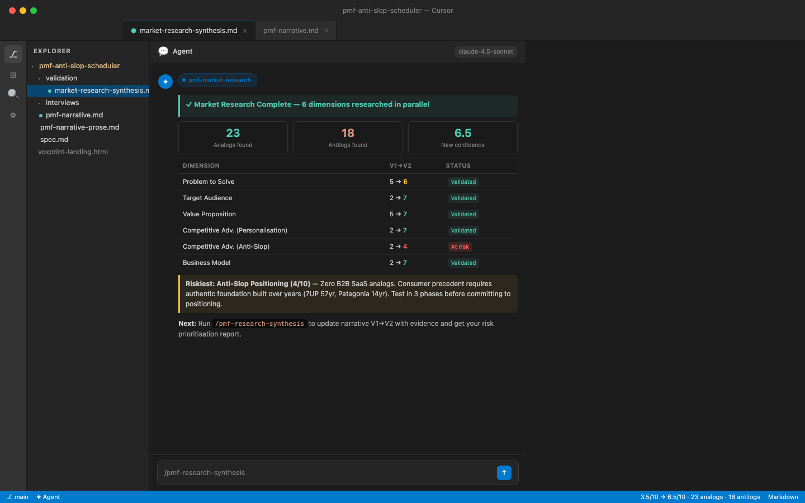

# PMF Skills


**Stop guessing. Start validating.**

Most product ideas die because teams build before they know what they're building *for*. PMF Skills gives your AI agent a structured workflow for product-market fit discovery — from a raw idea to an evidence-based hypothesis with ranked risks and a clear next step.

5 skills. One afternoon. A V1 PMF narrative you can actually act on.

---

## Get started in one command

```
/pmf-hypothesis-builder
```

The agent walks you through 6 PMF dimensions interactively, assigns confidence scores, identifies your riskiest assumption, and writes your V1 narrative — structured or prose format. Takes 30–60 minutes. No prep needed.

---

## The transformation

**Before**: A product idea, a lot of conviction, and no structured way to know if you're right.

**After**: A written PMF hypothesis across 6 dimensions, evidence from market analogs and failure cases, a ranked risk table, and a specific next action — not "do more research."

The smallest step that gets you there: run `/pmf-hypothesis-builder` with your product idea right now.

---

## The 5-skill workflow

Run them in sequence. Each skill unlocks the next.

```
1. /pmf-hypothesis-builder   →   Build your V1 hypothesis (6 dimensions, 30–60 min)
2. /pmf-market-research      →   Validate with analogs & antilogs via parallel agents (10–15 min)
3. /pmf-research-synthesis   →   Synthesize evidence, score risk, update to V2 (20 min)
4. /pmf-validate             →   Extract assumptions from riskiest dimension, map & design experiment (30–45 min)
5. /pmf-status               →   Check where you are and get your next action (anytime)
```

`/pmf-status` is read-only — safe to run anytime to reorient after a break.

---

## Pick your scenario

**"I have a product idea but I've never structured it properly"**
```
/pmf-hypothesis-builder
```
Guides you through problem framing, target audience, value prop, competitive advantage, growth strategy, and business model. Produces a shareable narrative document.

**"I've written a hypothesis but I don't know if the market supports it"**
```
/pmf-market-research
```
Launches 6 parallel research agents — one per dimension — to find successful analogs ($10M+ revenue) and documented failure cases. Weeks of manual research in 10–15 minutes.

**"I have research and expert input and need to decide what to validate next"**
```
/pmf-research-synthesis
```
Calculates risk scores across all 6 dimensions using `(10 − Evidence Score) × Failure Impact`, identifies the single riskiest dimension, and updates your narrative from V1 to V2 with version history.

**"I know my riskiest dimension — now I need to design a real experiment"**
```
/pmf-validate
```
Takes your riskiest dimension and extracts 9 specific assumptions across Desirability, Viability, and Feasibility. Walk through a 2×2 importance/evidence map, identify the single assumption most likely to break your idea, and get a structured experiment brief with run instructions, metrics, and success/failure signals.

**"I'm picking this back up and need to know where I left off"**
```
/pmf-status
```
Scans your project folder, detects which stage you're in, shows confidence scores for all dimensions, and tells you exactly which skill to run next.

---

## The 6 PMF dimensions

Every skill works across the same framework:

| # | Dimension | What it defines |
|---|-----------|-----------------|
| 1 | Problem to Solve | The acute, outcome-oriented problem — never solution-framed |
| 2 | Target Audience | A specific "now" segment with clear expansion paths |
| 3 | Value Proposition | Customer-centric benefits, not feature lists |
| 4 | Competitive Advantage | Short-term gap + one long-term defensible moat |
| 5 | Growth Strategy | Traction channels (first customers) vs. scale channels |
| 6 | Business Model | Revenue formula, pricing, LTV, cost structure |

Confidence scores run 1–10 per dimension. V1 hypotheses typically sit at 4–6 — that's intentional. The workflow systematically raises them.

---

## In action

The workflow runs inside Cursor's agent chat. All output lands in structured markdown files your agent can read back on the next run.

**Step 1 — Trigger the skill and answer two questions**



**Step 2 — Define the problem using the outcome-motivation gap framework**



**Step 3 — Assign honest confidence scores across all 6 dimensions**



**Step 4 — V1 narrative written, riskiest dimension flagged**



**Step 5 — Run market research: 6 parallel agents, analogs + antilogs**



---

## Installation

In Cursor, run:

```
/add-plugin https://github.com/gnurio/pmf-plugin
```

Or search **PMF Skills** in the [Cursor Marketplace](https://cursor.com/marketplace).

---

## Example session

```
You: "I want to build a B2B SaaS tool for remote engineering teams"

→ /pmf-hypothesis-builder
  Agent guides you through all 6 dimensions
  Output: pmf-myproduct/pmf-narrative.md
  Overall confidence: 5.2/10 · Riskiest: Growth Strategy (3/10)

→ /pmf-market-research
  6 parallel agents research analogs and antilogs
  Output: validation/market-research-synthesis.md
  38 analogs identified · 12 failure cases documented

→ /pmf-research-synthesis
  Risk scores calculated · Narrative updated to V2
  Growth Strategy risk score: 28 · Recommendation: targeted validation
  Output: validation/risk-prioritization.md + pmf-narrative.md V2

→ /pmf-validate
  Input: "Growth Strategy — riskiest dimension"
  9 assumptions extracted across Desirability, Viability, Feasibility
  Riskiest assumption: "I believe consultants will switch tools if we promise better authenticity"
  Experiment brief: Smoke Test · Setup: short · Evidence strength: medium

→ /pmf-status
  Stage: Assumption Validation In Progress
  Next: Run smoke test, then interview 20 signups
```

---

## Your project folder

Skills create and manage a structured folder automatically:

```
pmf-{product-name}/
├── pmf-narrative.md          ← Versioned (V1 → V2 → V3…)
├── validation/
│   ├── market-research-synthesis.md
│   ├── expert-notes.md       ← Add your own expert call notes here
│   ├── risk-prioritization.md
│   └── targeted-validation-plan.md
├── interviews/               ← Add customer interview debriefs here
└── measurement/
    └── pmf-metrics.md        ← Set up once you're building
```

---

## What comes after

These 4 skills cover hypothesis and broad validation. The roadmap:

| Skill | Purpose |
|-------|---------|
| `/pmf-interview-prep` | Design a 30–50 customer interview script targeting your riskiest dimension |
| `/pmf-interview-synthesis` | Extract patterns across interviews into updated hypotheses |
| `/pmf-validation-planner` | Design targeted experiments for your riskiest dimension |
| `/pmf-metrics-setup` | Set up measurement once you're building |

---

## License

[CC BY 4.0](LICENSE) — free to use, share, and adapt with attribution.

Built by [George Nurijanian](https://github.com/gnurio) · [prodmgmt.world](https://prodmgmt.world)
